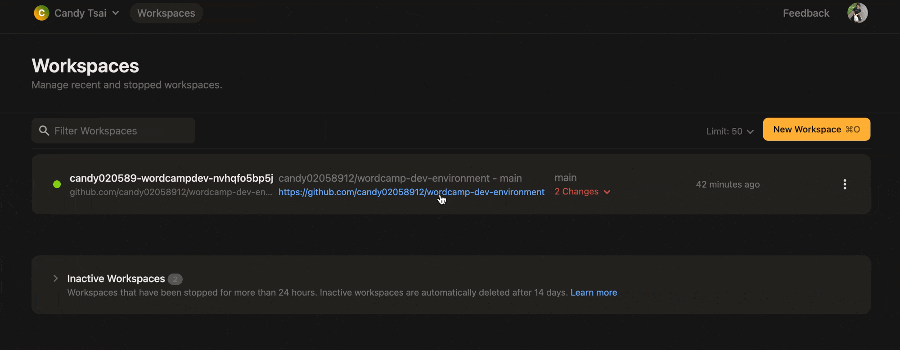

# WordCamp Development Environment

Setup the developement environment for https://github.com/WordPress/wordcamp.org with one click (and a couple of steps 😅).

[](https://gitpod.io/#https://github.com/candy02058912/wordcamp-dev-environment)

1. [Local], do SSH port forwarding by executing the following command:
```
sudo ssh -L 443:127.0.0.1:443 -N <gitpod ssh>
```

You can get the `<gitpod ssh>` by following the gif, please remember to only copy the text inside the `''`.
For example:
```
sudo ssh -L 443:127.0.0.1:443 -N candy020589-wordcampdev-nvhqfo5bp5j#redacted@candy020589-wordcampdev-nvhqfo5bp5j.ssh.ws-us110.gitpod.io
```



2. [Optional] Self-signed certificate

TBD

3. [Gitpod] Make sure you're in the `wordcamp.test` directory

4. [Gitpod] `docker compose up`

5. Visit https://wordcamp.test

Note: If you didn't go through the [Optional] Self-signed certificate step, Chrome will say that it is unsafe. Things might be able to still work normally and you can access the site by either typing `thisisunsafe` when you see the screen or click proceed.